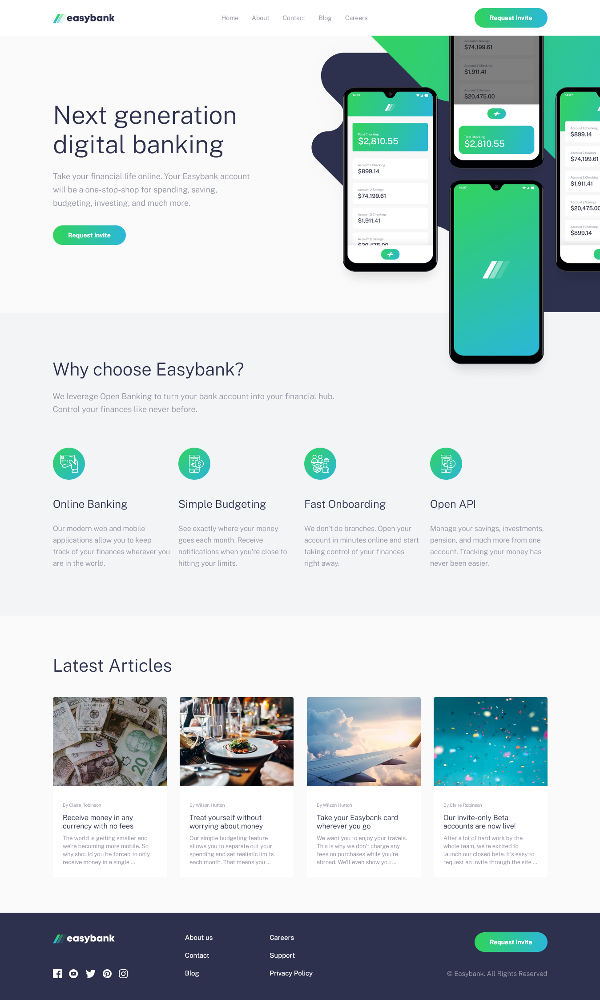

# Frontend Mentor - Easybank landing page solution

This is a solution to the [Easybank landing page](https://www.frontendmentor.io/challenges/easybank-landing-page-WaUhkoDN) challenge on Frontend Mentor. Frontend Mentor challenges help you improve your coding skills by building realistic projects.

## Table of contents

- [Getting started](#getting-started)
  - [For development](#for-development)
  - [Build for production](#build-for-production)
- [Overview](#overview)
  - [The challenge](#the-challenge)
  - [Screenshot](#screenshot)
  - [Links](#links)

## Getting started

### For development

1. Install the dependencies:

```bash
npm install
```

2. Launch the development server:

```bash
npm run dev
```

### Build for production

1. Switch to the `production` branch using **git**:

```bash
git checkout production
```

2. Build the final bundle:

```bash
npm run build
```

3. Navigate to the `/dist` folder that is the output directory of the final bundle and open the `index.html` file.

## Overview

### The challenge

Users should be able to:

- View the optimal layout for the site depending on their device's screen size
- See hover states for all interactive elements on the page

### Screenshot



### Links

- Solution URL: [Here](https://www.frontendmentor.io/challenges/easybank-landing-page-WaUhkoDN)
- Live Site URL: [Here](https://easybank-landing-page-amazingtool777.netlify.app/)
